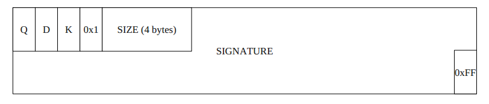

# QDK Area

To be able to determine if a QDK area is included in the QPKG package the first three bytes of the area

contains the text QDK which is followed by an optional amount of data blocks. Each block consists of a five

bytes header followed by the actual data. The first byte in the header indicates what kind of data is stored in

the block and the remaining four bytes contains the size of the data. The size shall be included in network

byte order to make it platform-independent. Last in the QDK area is a one byte tag with the value 0xFF to

indicate the end of the area. Currently, the only supported data type is 0x1 \(digital signatures\).

