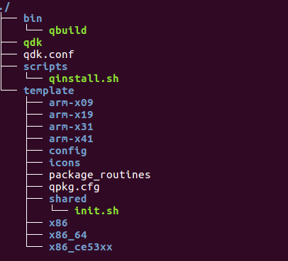

# Installation of QDK

Before we can start using QDK we have to install it. It is distributed as a platform-independent QPKG package and can be installed using the normal web interface. When installed and enabled QDK is ready to be used.

At installation a directory structure is created at the default QPKG location, which depends on whether it is installed on a RAID volume or a single drive. The exact location is available in the QDK\_PATH variable in the system-wide configuration file, `/etc/config/qdk.conf`, but it is usually `/share/MD0_DATA/.qpkg/QDK` on a RAID system and `/share/HDA_DATA/.qpkg/QDK` on a single drive system.

**qdk** is the init script used to enable and disable QDK. This script is run automatically when QDK is enabled or disabled in the web interface. It creates and removes a symbolic link to the **qbuild** application in `/usr/bin/qbuild` is the build script.

**qinstall.sh** is the part of the installation script that includes the generic installation functions common to all QPKG packages. This file is never edited by the user. All user defined actions are added to a separate file named `package_routines`.

The template directory include files for a new build environment that can be created using **qbuild**. By default it includes common subdirectories where the content should be placed and templates for the package specific installation functions, package\_routines, the QPKG configuration file, `qpkg.cfg`, and an init-script. The init-script, `init.sh`, is renamed to the same name as the package when the new build environment is created.

There are also four hidden files, `.qpkg_icon.gif`, `.qpkg_icon_80.gif`, `.qpkg_icon_gray.gif`, and `.uninstall.sh`.The three first files are the default icons used for QDK in the web interface and the last file is the script run to perform the required actions to clean up after QDK when it is removed using the web interface. This file iscreated automatically for all QDK based packages at installation time.

