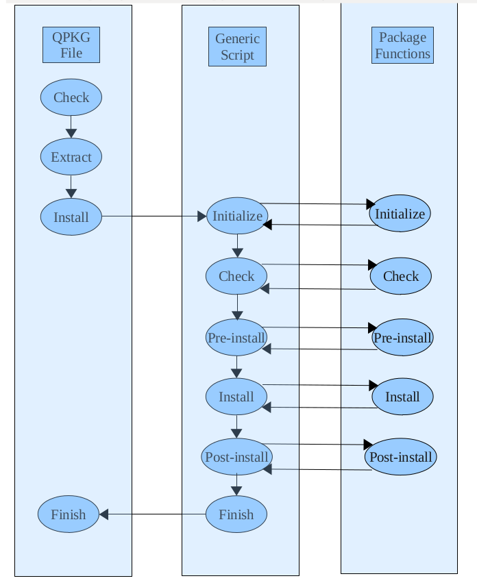

# Order of Execution

## Installation/Upgrade

When a QPKG package is installed or upgraded the following actions are run in a linear order.

First a check is performed to make sure that the mount point, `/mnt/HDA_ROOT`, where the initial installation files should be extracted exists \(this should always be true on a QNAP device\). If it is a platform specific QPKG package then an architecture check is also performed to make sure the QPKG is installed on the correct platform. If both checks are successful then a temporary installation directory, `/mnt/HDA_ROOT/update_pkg/tmp`, is created and the first level of QPKG packages are extracted to this directory – that is, the tar archive with the data files \(default is data.tar.gz, but other compression algorithms are possible which would result in a different file suffix\), the generic and package specific installation scripts\(qinstall.sh and package\_routines\), the QPKG configuration file \(qpkg.cfg\), any extra data packages that have been specified using QDK\_EXTRA\_FILE , and the optional files with MD5 checksums and configuration files. Next, the installation is started by running the generic installation script, qinstall.sh.

The generic installation script first locates the included data archive and assigns the file name to SYS\_QPKG\_DATA\_FILE. System variables are initialized with name and path to the default system shares and the system definitions SYS\_QPKG\_BASE , SYS\_QPKG\_INSTALL\_PATH , and SYS\_QPKG\_DIR are assigned valid values. If Optware packages are included in the QPKG package then a temporary local repository is assigned to the package tool's search path, so that the included files are available for a possible installation/upgrade in the requirement check for Optware packages. At an upgrade the list of installed file sis sorted and renamed, so a new list can be created and later compared with the old list. This is followed by performing any package specific initialization.

Next it checks that any specified requirements are fulfilled. If any required Optware package is missing then the latest version of the package is installed automatically either from the remote repository or from a package included in the QPKG package \(using QDK\_EXTRA\_FILE \). After the check for any QPKG\_REQUIRE or QPKG\_CONFLICT definitions in the QPKG configuration file, the package specific requirement checks are performed \(if defined\). If the requirements are OK then the pre-install phase is started.

In the pre-install phase the QPKG directory specified in SYS\_QPKG\_DIR is created if it is a new installation and configuration files are handled according to what was specified when the package was built. At an upgrade the current status of the QPKG \(enabled or disabled\) is stored to be able to restore it later. The service program is stopped if it exists \(usually not at a new installation\) and then any package specific pre-install actions are performed. The install phase starts with extracting the data from the data archive, $SYS\_QPKG\_DATA\_FILE , to the QPKG directory, extracting any \(optional\) included full path configuration files to their correct location, and restore any previously stored configuration files, followed by any package specific install actions. In the post-install phase any obsolete files from the previous installation are removed, any included QPKG icons are copied to `/home/httpd/RSS/images/`, symbolic links for the service program are created in `/etc/init.d,/etc/rcS.d`, and `/etc/rcK.d`, and the QPKG is registered in `/etc/config/qpkg.conf`. This is followed by any package specific post-install actions.

Finally, the script that shall be run when the QPKG is removed from the system is generated \(including any package specific actions\), if the QPKG was enabled before the upgrade then at this point the service program is also started, and a success message is written to the system log and also reported back to the web interface.

After a new installation the default is for the QPKG to be disabled. If we would like to force the QPKG to be enabled from the beginning then it is possible to set SYS\_QPKG\_SERVICE\_ENABLED to TRUE in one of the package specific functions, but it would be better to allow the user to decide when it should be enabled. After an upgrade the current status will be restored after the upgrade is finished. That is, if the QPKG was enabled before the upgrade then it is enabled after the upgrade and the service program is started \(if it fails to start then the status is set to disabled, though.\) This behavior can be stopped by setting SYS\_QPKG\_SERVICE\_ENABLED to FALSE in one of the package specific functions. If $SYS\_QPKG\_SERVICE\_ENABLED is FALSE then the QPKG is always disabled after the upgrade.

